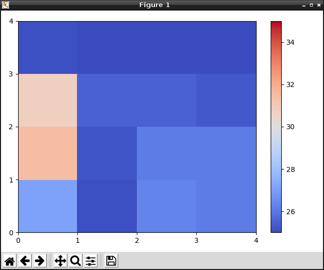

# d6t-grove-raspberrypi
オムロン製センサ D6T を Raspberry Pi 3 Model B で評価する為のモジュールと、モジュールを利用する場合のサンプルプログラムです。

D6T は対象物からの放射熱エネルギーをサーモパイル素子で受けることで対象物の表面温度を非接触で計測できる赤外線センサです。  
静止人物も検出できる高感度な人感センサとして利用できます。  


## 言語
- [英語](./README.md)
- [日本語](./README_ja.md)

## 概要
- grove_d6t.py  
D6T から GrovePi+ 経由でデータを取得するためのドライバモジュールです。

- sample_d6t.py  
ドライバモジュール経由で取得したデータをコンソール上で確認できるサンプルプログラムです。

- sample_gui_d6t.py  
ドライバモジュール経由で取得したデータをグラフで可視化して確認できるサンプルプログラムです。

***デモ:***  
sample_gui_d6t.py を実行すると以下のようなグラフを確認することができます。  



## インストール方法
1. 事前に依存関係のあるソフトウェアをインストールして下さい。  
    [依存関係](#link)
2. ターミナルを開き、次のコマンドを実行します。  
    ```
    $ mkdir omron_sensor
    $ cd omron_sensor
    $ git clone https://github.com/omron-devhub/d6t-grove-raspberrypi.git
    ```

## 使い方
サンプルプログラムを動作させる手順です。  
"pigpio"を使用する為に、事前に次のコマンドを実行してください。  
```
$ sudo pigpiod
```

-  sample_d6t.py  
ターミナルを開き、次のコマンドを実行します。  
    ```
    $ cd omron_sensor
    $ sudo python3 sample_d6t.py
    ```
- sample_gui_d6t.py  
ターミナルを開き、次のコマンドを実行します。  
    ```
    $ cd omron_sensor
    $ sudo pigpiod
    $ sudo python3 sample_gui_d6t.py
    ```

## <a name="link"></a>依存関係
d6t-grove-raspberrypi には次に挙げるソフトウェアとの依存関係があります。
- [Python3](https://www.python.org/)
- [GrovePi+](http://wiki.seeedstudio.com/GrovePi_Plus/)
- [matplotlib](https://matplotlib.org/)
- [pigpio](http://abyz.me.uk/rpi/pigpio/download.html)

## ライセンス
Copyright (c) OMRON Corporation. All rights reserved.

このリポジトリはMITライセンスの下でライセンスされています。
